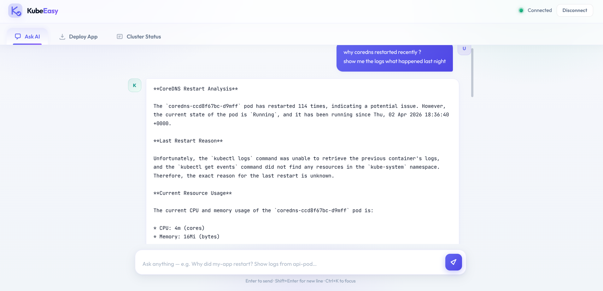
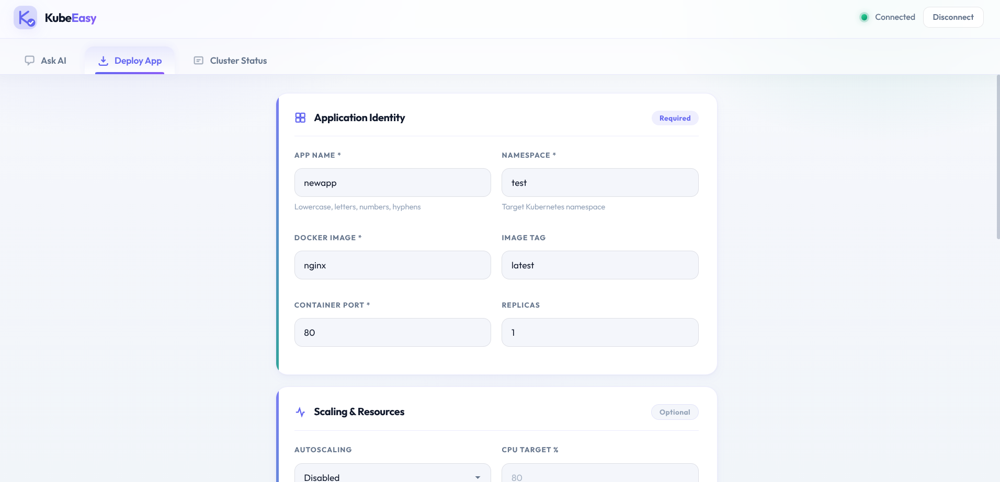
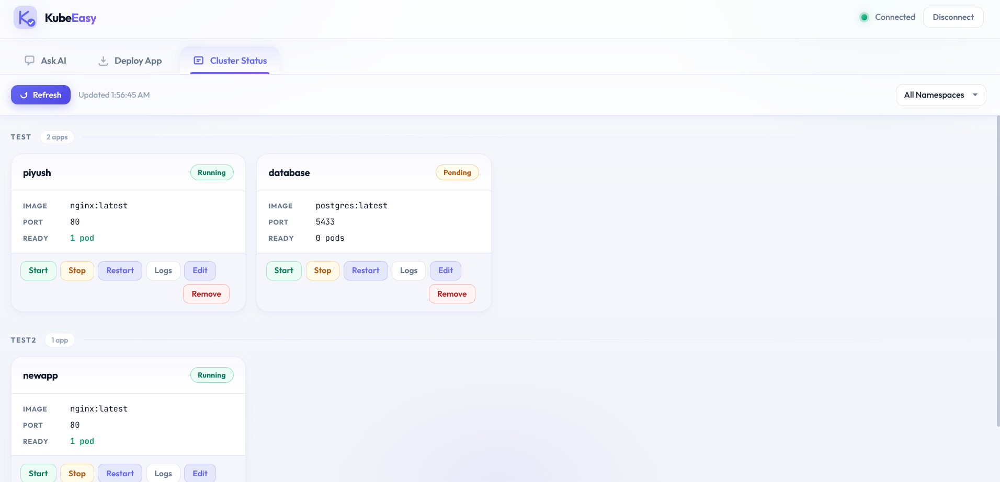
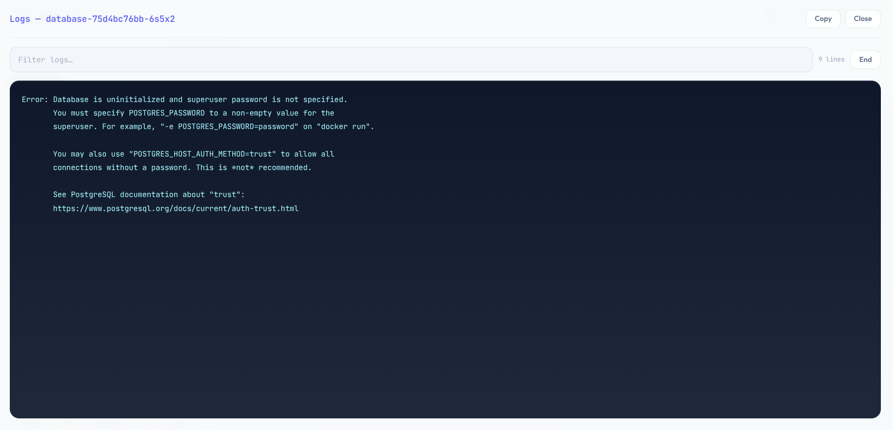

<div align="center">

<br/>

```
 ██╗  ██╗██╗   ██╗██████╗ ███████╗███████╗ █████╗ ███████╗██╗   ██╗
 ██║ ██╔╝██║   ██║██╔══██╗██╔════╝██╔════╝██╔══██╗██╔════╝╚██╗ ██╔╝
 █████╔╝ ██║   ██║██████╔╝█████╗  █████╗  ███████║███████╗ ╚████╔╝ 
 ██╔═██╗ ██║   ██║██╔══██╗██╔══╝  ██╔══╝  ██╔══██║╚════██║  ╚██╔╝  
 ██║  ██╗╚██████╔╝██████╔╝███████╗███████╗██║  ██║███████║   ██║   
 ╚═╝  ╚═╝ ╚═════╝ ╚═════╝ ╚══════╝╚══════╝╚═╝  ╚═╝╚══════╝   ╚═╝   
```

**Your Kubernetes cluster, explained in plain English. **

[](https://python.org)
[](https://fastapi.tiangolo.com)
[](https://helm.sh)
[](https://kubernetes.io)
[](https://qdrant.tech)
[](LICENSE)

<br/>

> **KubeEasy** is an AI-powered Kubernetes management assistant that lives *inside* your cluster.  
> Ask questions in plain English. Get real answers. No YAML headaches, no terminal juggling.

<br/>

</div>

---

## What is KubeEasy?

Managing a Kubernetes cluster usually means memorizing dozens of `kubectl` commands, understanding YAML configurations, and constantly switching between terminals. For developers and ops teams alike, this friction slows things down.

**KubeEasy removes that friction.**

It deploys a small AI assistant directly inside your cluster that:
- **Understands natural language** — ask *"Why is my pod crashing?"* and get a real answer
- **Executes live commands** — it can actually run `kubectl` and Helm commands on your behalf
- **Learns your cluster** — a background indexer continuously maps your workloads for instant recall
- **Requires no client-side tools** — everything runs through a simple web browser UI

Think of it as having a Kubernetes expert on-call, embedded in your cluster, available 24/7.

---






## How It Works — The Big Picture

```
┌─────────────────────────────────────────────────────────────────┐
│                         YOUR BROWSER                            │
│                    [ KubeEasy Web UI ]                          │
│           "Why is my frontend pod restarting?"                  │
└─────────────────────────┬───────────────────────────────────────┘
                          │  WebSocket (real-time)
┌─────────────────────────▼───────────────────────────────────────┐
│                     KUBERNETES CLUSTER                          │
│                                                                 │
│  ┌──────────────┐    ┌──────────────────┐    ┌──────────────┐  │
│  │   Frontend   │───▶│   AI Backend     │───▶│   Qdrant     │  │
│  │  (nginx)     │    │  (FastAPI)       │    │  (Vector DB) │  │
│  │              │    │                  │    │              │  │
│  │ Serves the   │    │ • Routes your    │    │ • Stores     │  │
│  │ web UI and   │    │   question to    │    │   embeddings │  │
│  │ proxies all  │    │   live kubectl   │    │   of all     │  │
│  │ traffic      │    │   OR RAG lookup  │    │   your pods  │  │
│  └──────────────┘    │ • Runs Helm cmds │    └──────────────┘  │
│                      │ • Streams logs   │                       │
│                      │ • Manages apps   │                       │
│                      └────────┬─────────┘                       │
│                               │  Uses ServiceAccount            │
│                      ┌────────▼─────────┐                       │
│                      │ Kubernetes API   │                       │
│                      │ (native access)  │                       │
│                      └──────────────────┘                       │
└─────────────────────────────────────────────────────────────────┘
```

### The Intelligence Layer

When you ask KubeEasy a question, it doesn't blindly call an LLM. It has a smart routing engine:

| Question Type | What Happens |
|---|---|
| *"Show me live logs for pod X"* | Runs `kubectl logs` in real-time and streams output |
| *"Why did my pod crash at 3am?"* | Queries live events + Kubernetes API for crash reasons |
| *"How many pods are in the payments namespace?"* | Hits the RAG index (fast, no live call needed) |
| *"Deploy my app with Helm"* | Executes your configured Helm script directly |

This hybrid approach means answers are **fast when possible, live when necessary**.

---

## Features

- **AI Chat Interface** — Ask anything about your cluster in plain English
- **Cluster Dashboard** — Live status of nodes, namespaces, and workloads
- **Log Streaming** — Stream pod logs directly in the browser
- **App Deployment** — Deploy and update Helm applications via UI
- **Token-based Auth** — Secure WebSocket authentication; no kubeconfig exposed to the browser
- **RAG-powered Context** — Vector search over cluster snapshots for instant answers
- **Background Indexing** — Cluster state is continuously embedded and kept fresh
- **Zero-dependency Install** — One script, uses pre-built images from Docker Hub

---

## Prerequisites

Before you begin, make sure you have:

| Requirement | Why It's Needed |
|---|---|
| A running Kubernetes cluster | Where KubeEasy will be deployed |
| `kubectl` configured and working | The install script uses it to talk to your cluster |
| **Helm 3** installed | Used to deploy KubeEasy into your cluster |
| **OpenSSL** installed | Generates a secure agent token during install |
| A **[Groq API key](https://console.groq.com/)** | Powers the AI (free tier available) |

> **No Docker needed on your machine** — the install script pulls pre-built images directly from Docker Hub.

---

## Quick Start — 3 Steps to Running KubeEasy

### Step 1 — Clone the repository

```bash
git clone https://github.com/piyush-man/kubeeasy.git
cd kubeeasy
```

### Step 2 — Configure your environment

```bash
cp .env.example .env
```

Now open `.env` in any text editor and fill in your Groq API key:

```env
# Required: Get your free key at https://console.groq.com/
GROQ_API_KEY=gsk_your_key_here

# Everything else has sensible defaults — you don't need to change anything else
# The pre-built Docker Hub images are already configured in .env.example
```

> **Tip:** The `.env.example` already points to pre-built images (`piyushman/kubemanager`) on Docker Hub.  
> You do **not** need to build anything from source. Just set your API key and go.

### Step 3 — Run the install script

```bash
chmod +x deploy/install.sh
./deploy/install.sh
```

That's it. The script will:

1. Auto-detect your kubeconfig (supports standard, MicroK8s, K3s, kubeadm, RKE2)
2. Detect your cluster's storage class for persistent volumes
3. Determine the best service type (NodePort or LoadBalancer) for your environment
4. Deploy everything with `helm upgrade --install`
5. Print your **UI URL** and **agent token** to the console
6. Save connection details to `.agent-connection.txt` in the repo root

**Sample install output:**
```
✔ Kubeconfig detected: /home/user/.kube/config
✔ Storage class detected: standard
✔ Deploying KubeEasy via Helm...
✔ Deployment complete!

──────────────────────────────────
  KubeEasy is ready!
  UI URL:      http://192.168.1.10:32080
  Agent Token: eyJhbGci...
──────────────────────────────────
Connection details saved to .agent-connection.txt
```

---

## Accessing KubeEasy

1. **Open the URL** printed by the install script in your browser
2. **Paste the agent token** when prompted on the login screen
3. **Start asking questions!**

If you skipped the `GROQ_API_KEY` in `.env`, you'll see a one-time setup wizard in the UI — paste your key there, and KubeEasy will patch itself and restart automatically.

---

## Example Conversations

Once connected, you can ask things like:

```
You: Why is my nginx pod in CrashLoopBackOff?

KubeEasy: The pod nginx-7d9f8b-xk2p is crashing because it cannot bind to port 80.
          The previous process left a lock file at /var/run/nginx.pid. Last exit code: 1.
          Recommendation: Delete the pod to let it restart cleanly — the lock file 
          will be cleared on next start.
```

```
You: Show me all pods that are not running

KubeEasy: Found 3 pods not in Running state:
          • payments-worker-abc123 [Pending] — no nodes match resource requests (need 4Gi RAM)
          • cache-redis-xyz789 [CrashLoopBackOff] — OOMKilled 6 times in last hour
          • batch-job-old [Completed] — finished successfully 2h ago
```

```
You: Deploy my app "store-api" using Helm with image tag v2.1.0

KubeEasy: Running Helm upgrade for store-api with tag v2.1.0...
          ✔ Deployed successfully. 2/2 pods ready.
```

---

## Configuration Reference

All configuration lives in your `.env` file. Here's what each variable controls:

| Variable | Default | Description |
|---|---|---|
| `GROQ_API_KEY` | *(empty)* | Your Groq API key for AI features |
| `BACKEND_IMAGE_REPO` | `docker.io/piyushman/kubeeasy-api` | Backend container image |
| `FRONTEND_IMAGE_REPO` | `docker.io/piyushman/kubeeasy-ui` | Frontend container image |
| `IMAGE_TAG` | `latest` | Image tag for both containers |
| `HELM_NAMESPACE` | `kubeeasy` | Kubernetes namespace to deploy into |
| `HELM_RELEASE` | `kubeeasy` | Helm release name |
| `STORAGE_CLASS` | *(auto-detected)* | PVC storage class for Qdrant data |
| `SERVICE_TYPE` | *(auto-detected)* | `NodePort` or `LoadBalancer` |
| `AGENT_TOKEN` | *(auto-generated)* | Shared secret for UI authentication |
| `KUBECONFIG` | *(auto-detected)* | Explicit path to kubeconfig file |

---

## Repository Structure

```
kubeeasy/
├── api/              # FastAPI backend — WebSocket API, AI routing, setup endpoints
├── client/           # Web UI — single-page app served by nginx
├── rag/              # RAG query engine — decides live vs. vector-search routing
├── embeddings/       # Text embedding logic for cluster state
├── collector/        # Collects pod/node/namespace data from Kubernetes API
├── vector_db/        # Qdrant client wrapper and schema
├── processor/        # Processes raw cluster data into embeddable text
├── scripts/          # Shell scripts for Helm deploy/update lifecycle
├── appconfig/        # Helm subchart for apps deployed through the UI
├── deploy/
│   ├── helm/         # Main Helm chart for KubeEasy itself
│   ├── install.sh    # ← The install script you run
│   ├── Dockerfile    # Multi-stage build (if building from source)
│   └── README.md     # Advanced Helm and build-from-source docs
├── .env.example      # Template with pre-built image references
└── requirements.txt  # Python dependencies
```

---

## What's Happening Under the Hood

### The RAG Pipeline (How KubeEasy "knows" your cluster)

Every few minutes, a background thread runs this cycle:

```
Collect → Process → Embed → Store → Prune

1. COLLECT  — Calls Kubernetes API: lists all pods, nodes, namespaces, events
2. PROCESS  — Converts raw API objects into human-readable text descriptions
3. EMBED    — Sends text through an embedding model to create vector representations
4. STORE    — Upserts vectors + metadata into Qdrant (the vector database)
5. PRUNE    — Removes vectors for resources that no longer exist
```

When you ask a question, the RAG engine:
1. Embeds your question into a vector
2. Finds the most semantically similar cluster state entries in Qdrant
3. Feeds those entries as context to the LLM (Groq)
4. Returns a grounded, cluster-specific answer — not a generic response

### Authentication Flow

```
Browser                    Backend
   │                          │
   │── WebSocket connect ────▶│
   │                          │
   │── First message:         │
   │   { token: "..." } ────▶│  ← constant-time comparison
   │                          │     (prevents timing attacks)
   │◀── { status: "ok" } ────│
   │                          │
   │── { action: "ask",       │
   │    query: "..." } ─────▶│
   │                          │
   │◀── streamed response ────│
```

The token is generated by the install script (or you can set your own in `.env`). It never leaves your cluster infrastructure.

---

## Troubleshooting

**Pods stuck in `ImagePullBackOff`**
```bash
# Verify nodes can reach Docker Hub
kubectl describe pod <pod-name> -n kubeeasy | grep -A5 Events
# If on an air-gapped cluster, set a registry mirror in .env before reinstalling
```

**PVCs stuck in `Pending`**
```bash
# Check available storage classes
kubectl get storageclass
# Set the correct one in .env
STORAGE_CLASS=your-storage-class-name
# Then re-run ./deploy/install.sh
```

**No external IP on LoadBalancer service**
```bash
# Option 1: Use NodePort instead
# Add to .env: SERVICE_TYPE=NodePort

# Option 2: Port-forward directly (quick test)
kubectl port-forward svc/kubeeasy-frontend 8080:80 -n kubeeasy
# Then open http://localhost:8080
```

**WebSocket connection fails in the UI**
- Make sure you're accessing the **frontend** URL (the one printed by the install script)
- The frontend proxies `/ws` to the backend — do not try to connect directly to the backend port
- Check that both frontend and backend pods are in `Running` state:
  ```bash
  kubectl get pods -n kubeeasy
  ```

**Groq API errors**
- Verify your key at [console.groq.com](https://console.groq.com)
- You can update the key without reinstalling: use the setup wizard in the UI, or:
  ```bash
  kubectl create secret generic kubeeasy-secrets \
    --from-literal=GROQ_API_KEY=your_new_key \
    -n kubeeasy --dry-run=client -o yaml | kubectl apply -f -
  kubectl rollout restart deployment/kubeeasy-api -n kubeeasy
  ```

---

## Building From Source (Optional)

Only needed if you modify the application code.

```bash
# Build the backend image
docker build -f deploy/Dockerfile --target backend \
  -t your-registry/kubeeasy-api:latest .

# Build the frontend image
docker build -f deploy/Dockerfile --target frontend \
  -t your-registry/kubeeasy-ui:latest .

# Push to your registry
docker push your-registry/kubeeasy-api:latest
docker push your-registry/kubeeasy-ui:latest
```

Then update `.env`:
```env
BACKEND_IMAGE_REPO=your-registry/kubeeasy-api
FRONTEND_IMAGE_REPO=your-registry/kubeeasy-ui
IMAGE_TAG=latest
```

And re-run `./deploy/install.sh`. See [`deploy/README.md`](deploy/README.md) for advanced Helm options.

---

## Security Considerations

- **Treat the agent token like a password.** Anyone with this token can execute operations on your cluster through KubeEasy.
- The backend uses a **ClusterRole** with broad read/write permissions — this is intentional for a management tool. Deploy only on clusters you own/trust.
- Your Groq API key is stored as a Kubernetes `Secret`, not in environment variables on the container directly.
- No credentials are ever sent to the browser or stored client-side.

---

## Tech Stack

| Component | Technology |
|---|---|
| Backend API | Python 3.11, FastAPI, WebSockets |
| AI / LLM | Groq (LLaMA 3 family) |
| RAG Pipeline | Custom, with Qdrant vector search |
| Vector Database | Qdrant |
| Frontend | HTML/CSS/JS (served via nginx) |
| Packaging | Helm 3, Docker (multi-stage) |
| In-cluster Auth | Kubernetes ServiceAccount + RBAC |

---

## Contributing

Contributions are welcome! Please open an issue first to discuss what you'd like to change.

1. Fork the repository
2. Create a feature branch (`git checkout -b feature/your-feature`)
3. Commit your changes (`git commit -m 'Add your feature'`)
4. Push to the branch (`git push origin feature/your-feature`)
5. Open a Pull Request

---

<div align="center">

**Made with ☸️ and ❤️ for the Kubernetes community**

*If KubeEasy helped you, consider giving it a ⭐ on GitHub!*

</div>
